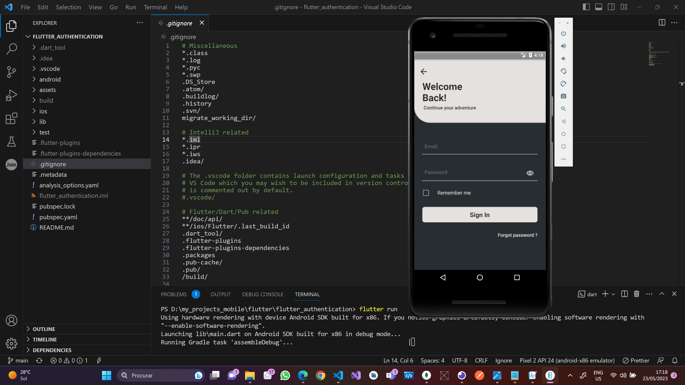
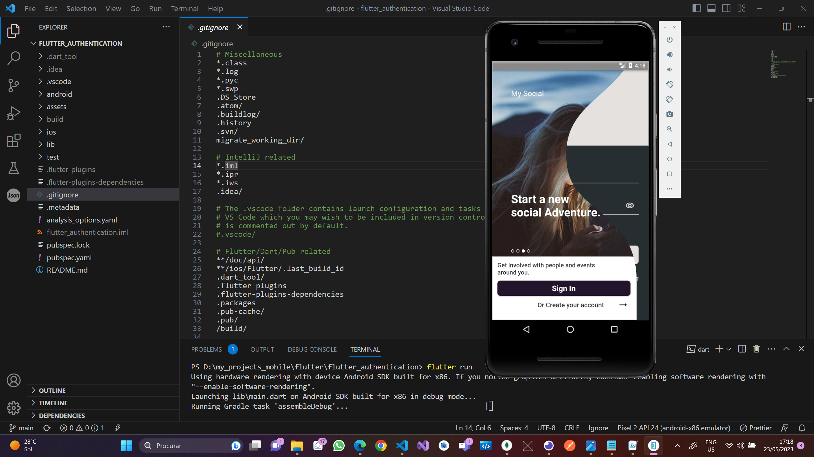

# flutter_authentication_Register

Flutter app with animated screens for authentication and user registration, using bloc pattern, dio, lottie and liquid_swipe.

## Getting Started

Esse projeto é um ponto de partida para quem está estudando ui design e bloc pattern para autenticação em Flutter.
Clone o projeto e estude o código, fique a vontade para editar ou modificar o layout como quiser, só não esqueça de dar aquela estrelinha no repositório (projeto) e até o próximo projeto.

how to clone this repositorion :
  -git clone https://github.com/EduardoPembeleAfonso/flutter-auth-and-register-animated

- [Lab: Write your first Flutter app](https://docs.flutter.dev/get-started/codelab)
- [Cookbook: Useful Flutter samples](https://docs.flutter.dev/cookbook)

For help getting started with Flutter development, view the
[online documentation](https://docs.flutter.dev/), which offers tutorials,
samples, guidance on mobile development, and a full API reference.

D:\my_projects_mobile\flutter\Flutter_Ui\flutter_application_ui\assets/image1
## Project images : 

<!--  -->

